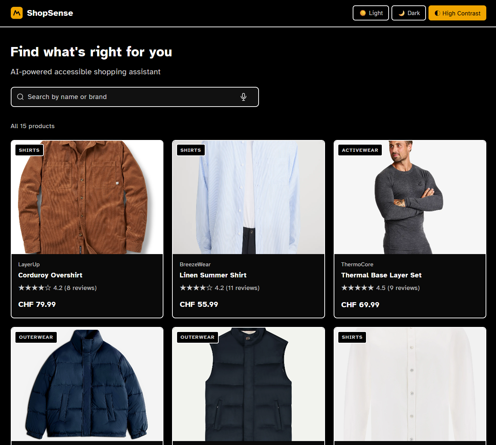
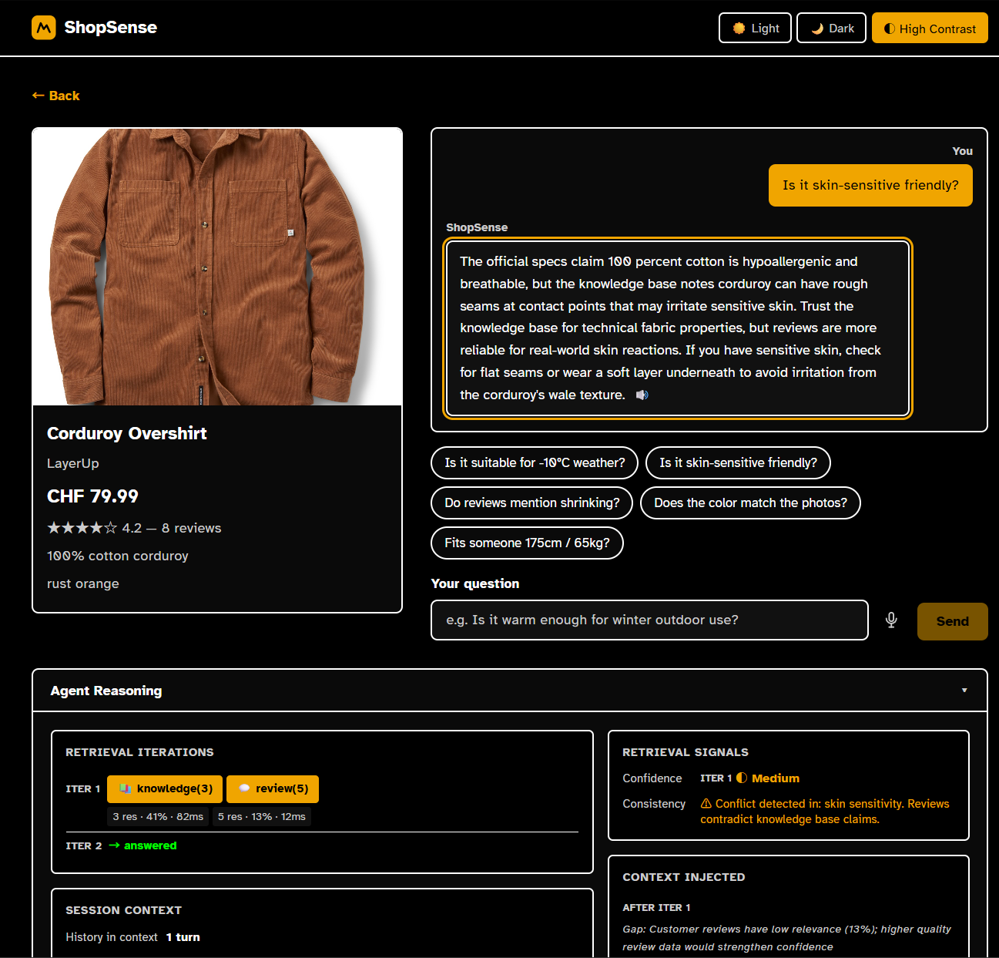
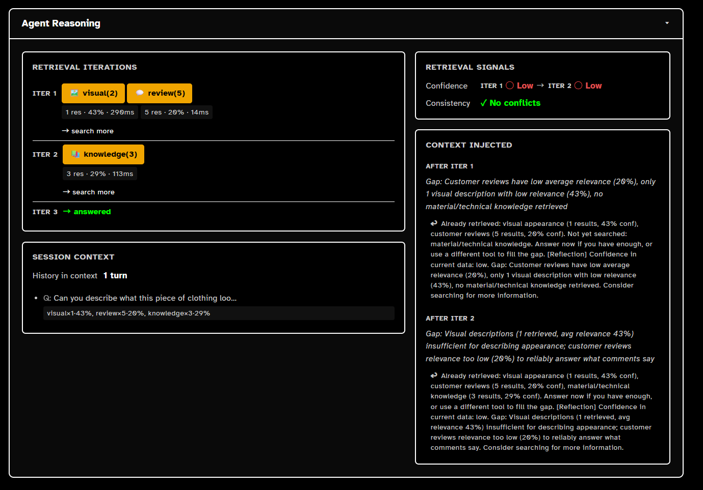
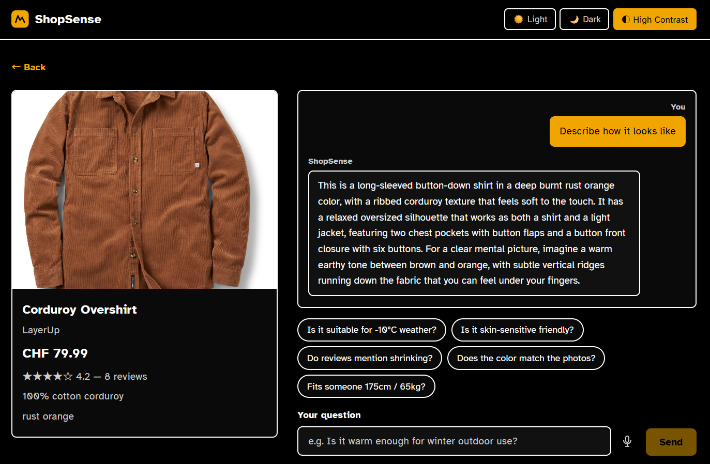
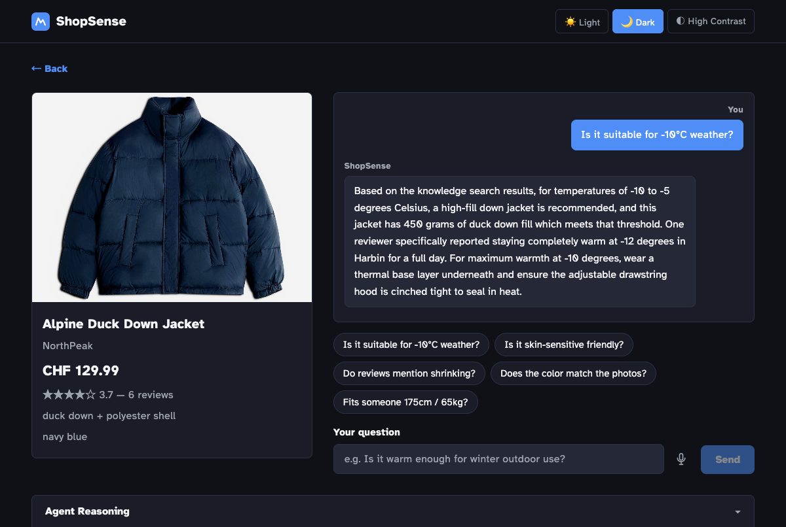
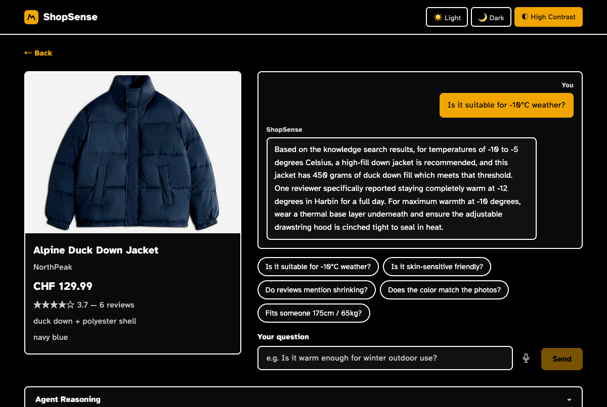

# ShopSense: AI Shopping Assistant for Visually Impaired Users

> **From "relying on others to describe" to "making independent, informed decisions."**

ShopSense is a **voice-first AI shopping assistant** designed for visually impaired users. Using a multi-modal ReAct agent, it transforms product images and thousands of reviews into trustworthy, perceivable purchase recommendations.

---

## 🎬 Project Showcase

### 1. Overall Interface


*High Contrast - Displaying 15 products in a grid layout with search and voice input support*

### 2. AI Intelligent Q&A


*User asks "Is it skin-sensitive friendly?" and AI detects data conflicts with warnings*

**Conversation Example**:
> **User**: Is it skin-sensitive friendly?  
> **AI**: The official specs claim 100 percent cotton is hypoallergenic and breathable, but the knowledge base notes corduroy can have rough seams at contact points that may irritate sensitive skin···

### 3. Transparent Reasoning Process (Agent Reasoning)


*Demonstrating ReAct Agent's complete retrieval chain: Visual → Reviews → Knowledge → Generate Answer*

**Technical Highlights**:
- **Multi-turn Retrieval**: Visual (43%) → Reviews (20%) → Knowledge (29%) → Comprehensive Judgment
- **Confidence Assessment**: LLM real-time evaluation of data sufficiency
- **Gap Analysis**: Automatic identification of information gaps and supplementary searches

### 4. Visual Description Capability


*AI provides detailed product appearance description*

> **User**: describe how it looks  
> **AI**: This is a long-sleeved button-down shirt in a deep burnt rust orange color, with a ribbed corduroy texture that feels soft to the touch. It has a relaxed oversized silhouette that works as both a shirt and a light jacket..

### 5. Accessibility Theme Support


*Dark mode - Suitable for low-light environments*


*High contrast mode - Specifically designed for visually impaired users with clear black and white contrast*

---

## ✨ Core Innovations

### 🎯 Conflict Detection System

**Original Feature**. Automatically compares official product descriptions against real buyer feedback and proactively warns users when conflicts are detected.

**Example**:
- **Official Description**: "extremely warm"
- **User Reviews**: "thin fabric, not warm enough"
- **AI Response**: "⚠️ Conflict detected between official description and buyer reviews — warmth claims may be overstated. Multiple reviewers mentioned thin fabric."

### 🧠 ReAct Reasoning Loop

```
Thought → Action → Observation → Reflection → Answer
```

Based on question intent, the agent autonomously selects tools, evaluates results, and decides whether further search is needed (up to 3 iterations), ensuring every recommendation is evidence-based.

### 🔍 Multi-Source Retrieval Strategy

| Tool | Data Source | Use Case |
|------|-------------|----------|
| **visual_search** | Pre-generated image descriptions | Color, silhouette, texture |
| **review_search** | User reviews | Sizing, durability, real-world experience |
| **knowledge_search** | Professional knowledge base | Material properties, warmth, skin compatibility |

### ♿ Accessibility Design

- **Voice Input**: Keyboard shortcut ⌥V (Mac) / Alt+V (Windows) activates voice recognition
- **Conclusion First**: First sentence of answer is always direct (Yes/No/Likely)
- **TTS-Friendly**: Symbols like %, /, ★ disabled — all expressed in words
- **Length Control**: Maximum 2-3 sentences for screen reader compatibility
- **Three Themes**: Light / Dark / High Contrast

---

## 🛠️ Technical Architecture

| Component | Technology |
|-----------|------------|
| Vector Database | Qdrant (Cosine Similarity) |
| Embedding | all-MiniLM-L6-v2 (Local, 384-dim) |
| LLM | kimi-k2.5 / Claude (OpenAI-compatible API) |
| VLM | Llama-4-Scout-17B (Visual description generation) |
| Backend | FastAPI + Python 3.10 |
| Frontend | React + Vite (ARIA-compliant) |

### Project Structure

```
shopsense/
├── agent/
│   ├── react.py              # Core ReAct reasoning loop
│   └── tools/                # Three retrieval tool implementations
├── backend/main.py           # FastAPI service
├── frontend/                 # React frontend
├── core/embeddings.py        # Local embedding model
├── data/                     # Product/review/knowledge/visual description data
└── scripts/
    ├── setup_collections.py  # Initialize Qdrant
    ├── ingest_all.py         # Data import
    └── generate_visual_descriptions.py  # VLM generates visual descriptions
```

---

## 🚀 Quick Start

### 1. Environment Setup

```bash
cp .env.example .env
# Edit .env and fill in API Keys
```

**Required**:
- `QDRANT_URL` - Qdrant Cloud free cluster
- `DASHSCOPE_API_KEY` - LLM API Key

**Optional**:
- `OPENAI_API_KEY` - Enable OpenAI TTS voice synthesis

### 2. Install Dependencies

```bash
pip install -r requirements.txt
cd frontend && npm install
```

### 3. Initialize Data

```bash
# Create Qdrant collections
python scripts/setup_collections.py

# Import data (first run downloads 90MB embedding model)
python scripts/ingest_all.py
```

### 4. Start Services

```bash
# One-click start
bash launch.sh

# Or start separately
python -m uvicorn backend.main:app --reload --port 8000
cd frontend && npm run dev -- --host
```

Visit http://localhost:5173

---

## 📊 Performance

- **Response Time**: ~10-15 seconds (including 2-3 retrieval rounds)
- **Accuracy**: Reduces misleading purchase recommendations through Conflict Detection
- **Accessibility Score**: WCAG 2.1 AA level support

---

## 🎯 Application Scenarios

1. **Independent Shopping for Visually Impaired**: No need to rely on others to describe product appearance
2. **Product Information Conflict Alerts**: Automatically identifies "not as advertised" risks
3. **Personalized Recommendations**: Matches reviews based on user height and weight
4. **Multi-language Support**: Underlying extensible multi-language LLM capability

---

## 🏆 Project Highlights

- ✅ **First-of-its-kind Conflict Detection**: Automatic conflict detection between official descriptions and real reviews
- ✅ **Transparent AI**: Agent Reasoning panel displays complete reasoning chain
- ✅ **Truly Accessible**: Voice input, high contrast, TTS optimization — not an afterthought
- ✅ **Multi-turn ReAct**: Autonomous tool selection and adaptive retrieval depth
- ✅ **Production-Ready**: Complete frontend and backend, ready for deployment

---

## 📄 License

MIT License - Open source for research and accessibility assistance scenarios

---

**Made with ❤️ for accessibility.**
